# Assignment 1 - ReactJS app.

Name: Liangyu Chen

## Overview.

A Movie Fan Web App based on React JS and data from TMDB.

### Features.
A bullet-point list of the ADDITIONAL user I added to the Movies Fan app.

+ Feature 1 - Totally 14 endpoints and 9 new endpoints.
+ Feature 2 - Totally 18 views and 11 new views.
+ Feature 3 - Routing including 6 parameterized URLs.
+ Feature 4 - Storybook support.
+ Feature 5 - Dynamic and interactive UI, Material UI.
+ Feature 6 - Web Form.
+ Feature 7 - Extensive data hyperlinking.
+ Feature 8 - Styled Components 3rd party components.
+ Feature 9 - Firebase authentication


## Setup requirements.

Outline any non-standard setup steps necessary to run app locally after cloning the repo.
```
npm install
```


## API endpoints.
List the TMDB endpoints used, giving the description and pathname for each one.
https://api.themoviedb.org/3/<<>>?api_key=<<api_key>>&language=en-US

+ Discover list of movies. - discover/movie
+ Get a list of movies in theatres. - movie/now_playing
+ Get a list of the current popular movies on TMDB. - movie/popular
+ Get the top rated movies on TMDB. - movie/top_rated
+ Get a list of upcoming movies in theatres. - movie/upcoming

+ Get the primary information about a movie. - movie/{movie_id}
+ Get the list of official genres for movies. - genre/movie/list
+ Get the images that belong to a movie. - movie/{movie_id}/images
+ Get the user reviews for a movie. - movie/{movie_id}/reviews
+ Get a list of recommended movies for a movie. - movie/{movie_id}/recommendations

+ Get the cast and crew for a movie. - movie/{movie_id}/credits
+ Get the list of popular people on TMDB. - person/popular
+ Get the primary person details by id. - person/{person_id}
+ Get the images for a person. - person/{person_id}/images


## App Design.

### Component catalogue.
Insert a screenshot from the Storybook UI that lists all the stories for the app's components, and highlight those relating to __new/modified components__.
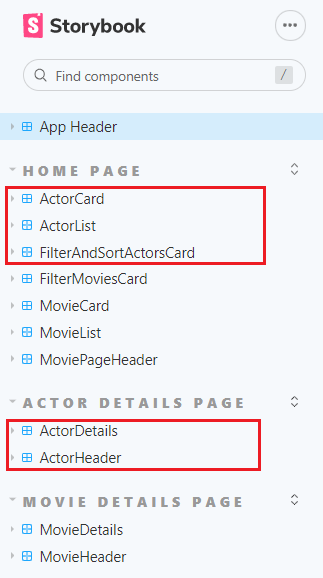


### UI Design.

Insert screenshots of the __new/modified app pages__ developed (and modified existing pages), Include an appropriate caption for each one.

>Top tool bar header to navigate to different pages and log in or out the system. 


>Shows detailed information on a movie. Clicking the 'Reviews' floating action button will display extracts from critic reviews. Clicking "RECOMMENDATIONS" button will display recommendations movies page of this movie. Clicking "CREDITS" will display credits page of this movie.
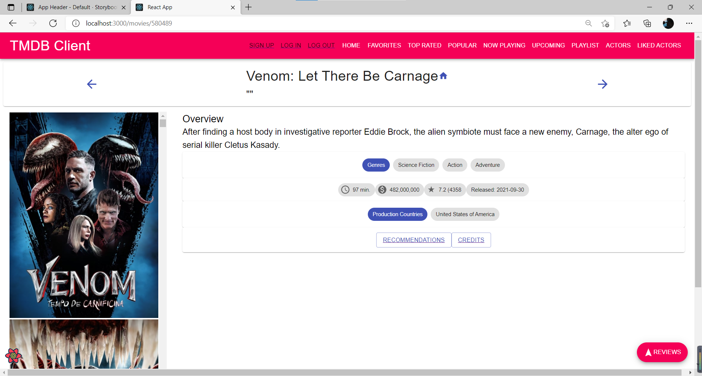

>Display the recommendations movies page by clicking "RECOMMENDATIONS" button on movie details page.
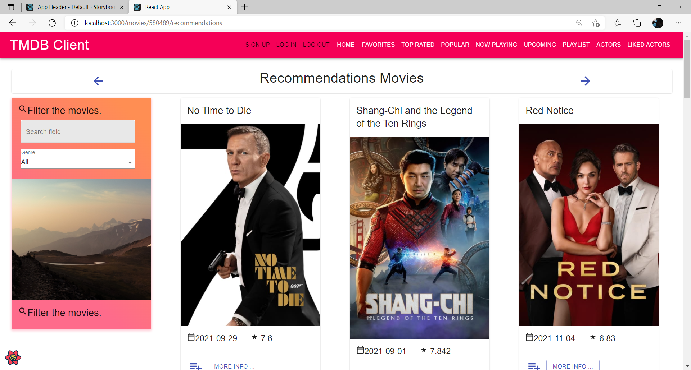

>A message will pop up by clicking "add to playlist" icon button.
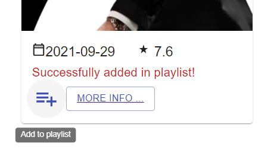

>Display the credits page of this movie by clicking "CREDITS" button on movie detalis page.
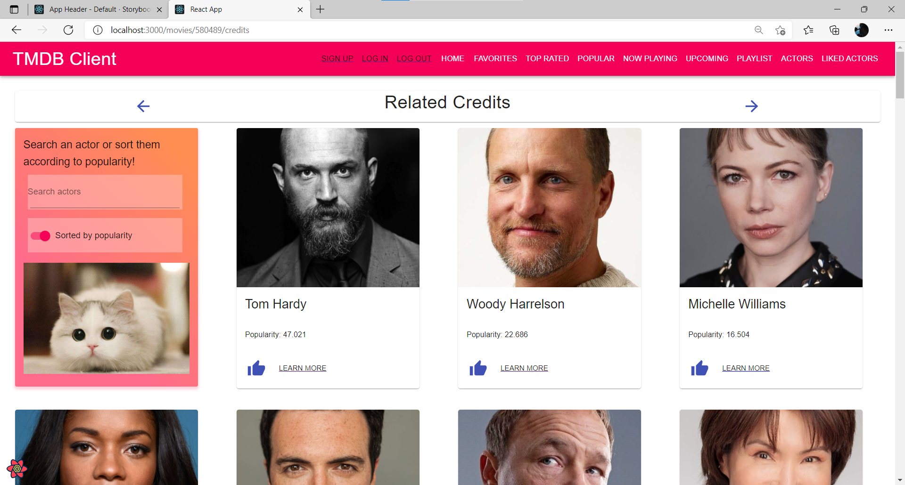

>An avator will pop up by clicking "add to likes" icon button.
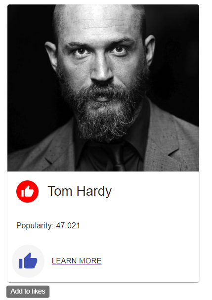

>Display detailed infromation of this credit by clicking "LEARN MORE" button on the credits page.


>Filter and sort credits using this card.
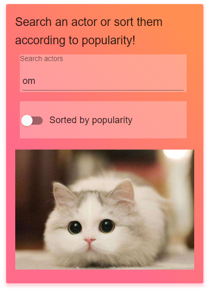
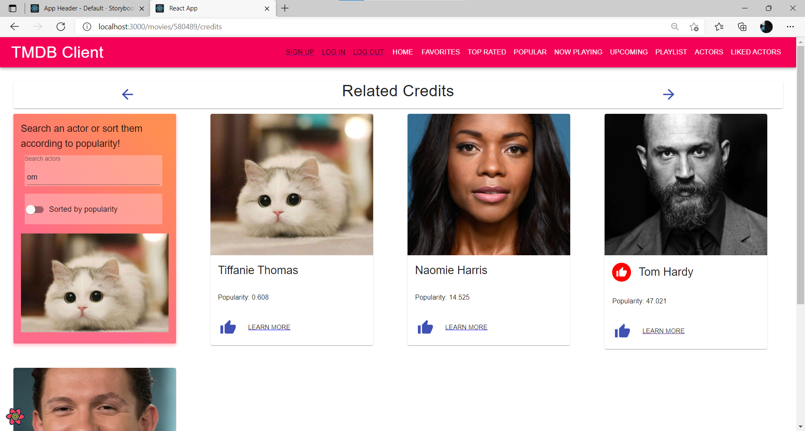

>Display actors page by clicking "ACTORS" on the navigation bar.
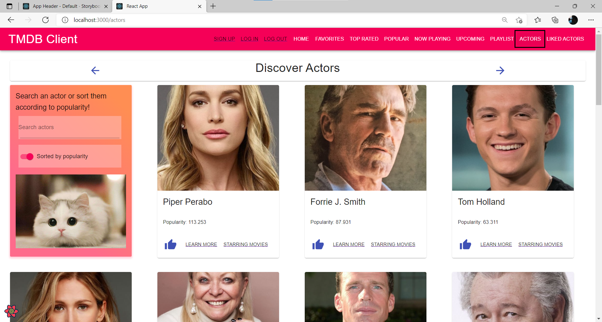

>Display the starring movies page of this actor by clicking "STARRING MOVIES" button on the actor card.
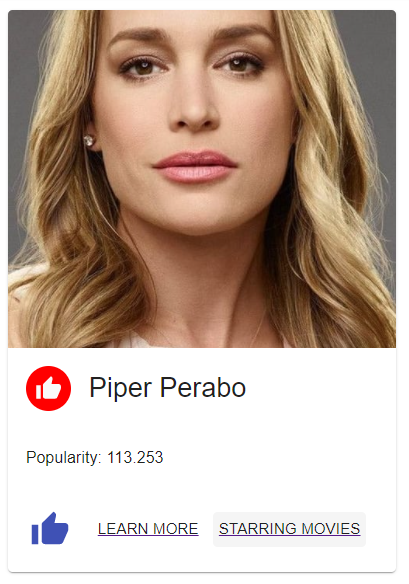
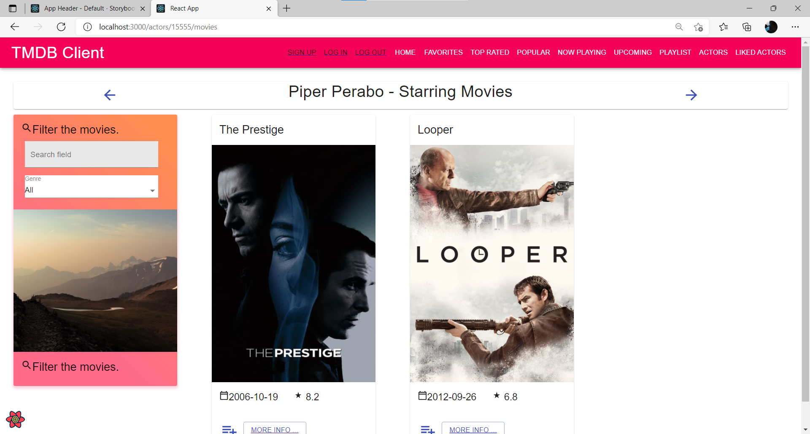

>Display the likes actors page by clicking "LIKED ACTORS" button on the navigation bar.
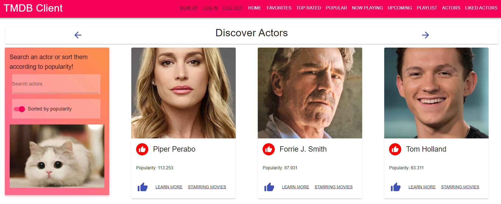
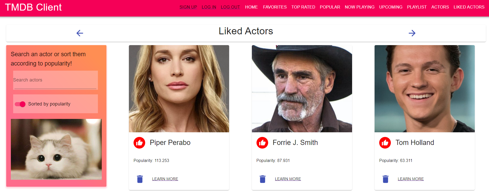

>Delete actor from the likes actors page by clicking "DELETE" icon button on actor card.
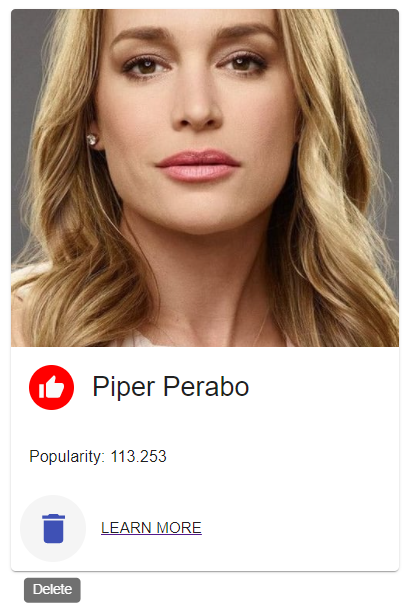
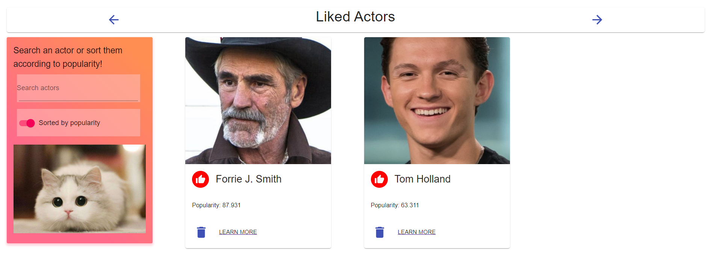

>Display the top rated movies by clicking "TOP RATED" button on the navigation bar.
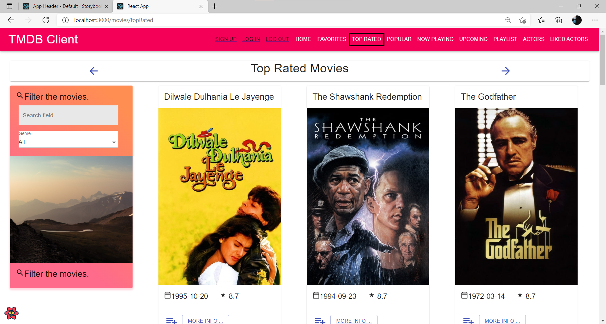

>Display the popular movies by clicking "POPULAR" button on the navigation bar.
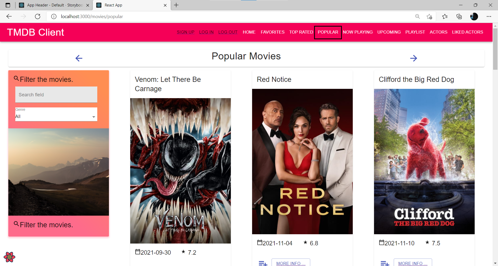

>Display the must movies by clicking "PLAYLIST" button on the navigation bar.
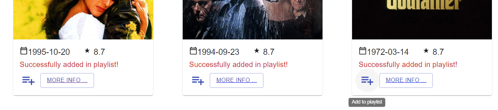
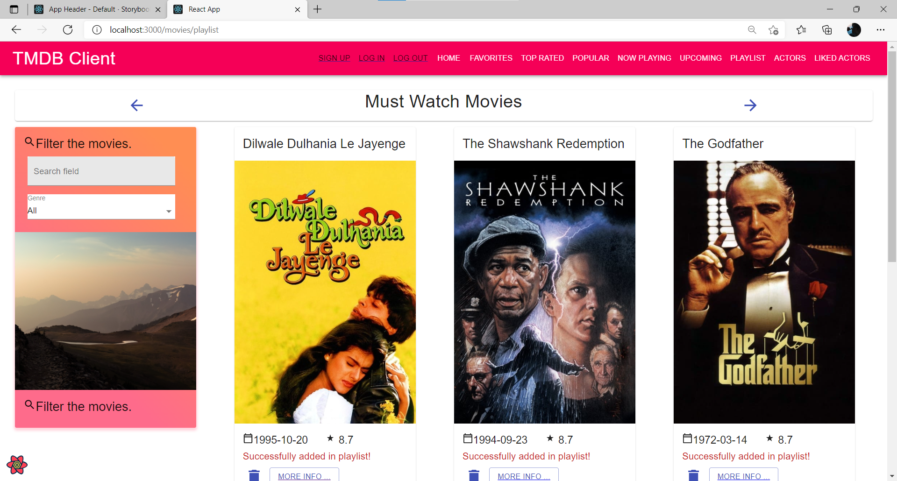

>Display the login page by clicking "LOG IN" button on the navigation bar.
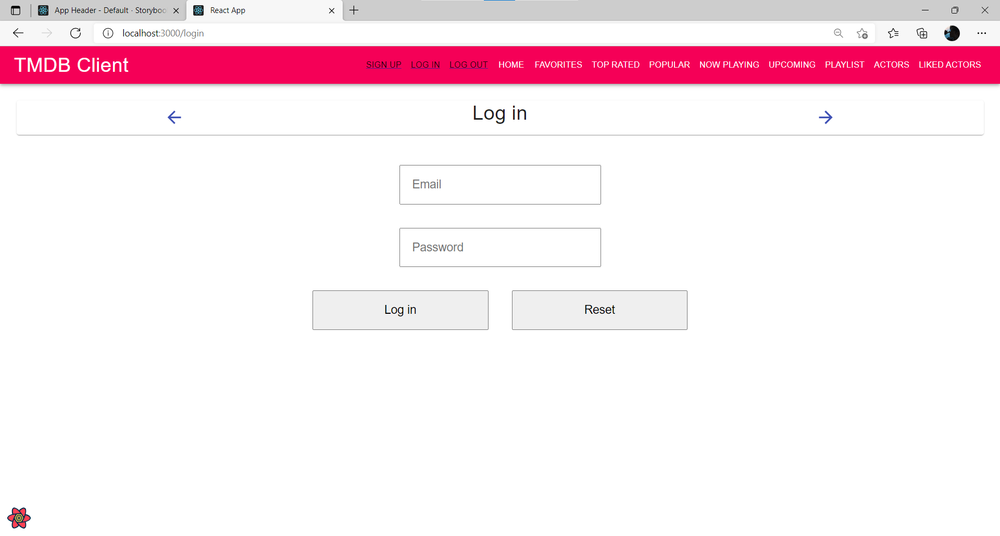

>A related message will pop up if log in authtication fails.
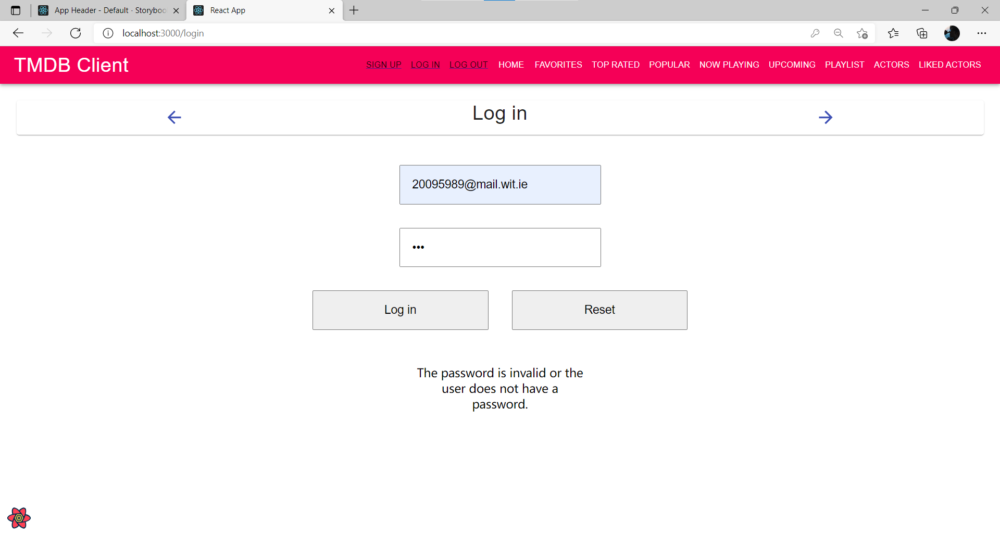

>Display the signup page by clicking "SIGN up" button on the navigation bar.
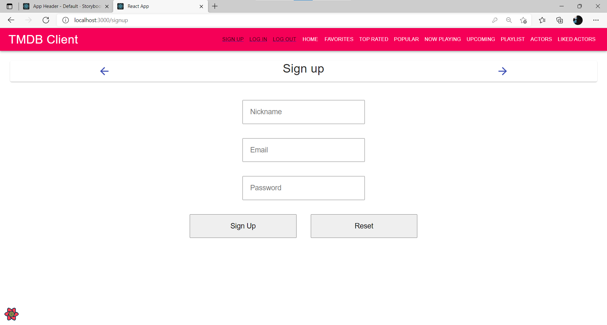

>A related message will pop up if sign up authtication fails.
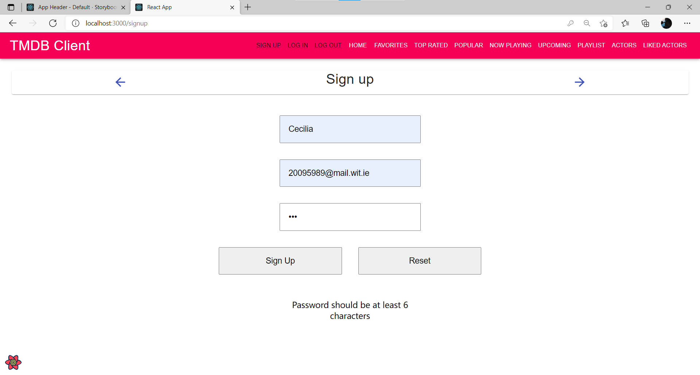


### Routing.

[ List the __new routes__ supported by your app and state the associated page.]

+ /blogs - displays all published blogs.
+ /blogs/:id - displays a particular blog.
+ /blogs/:id/comments - detail view of a particular blog and its comments.
+ etc.

[If relevant, state what aspects of your app are protected (i.e. require authentication) and what is public.]

## Independent learning (If relevant).

[ Itemize the technologies/techniques you researched independently and adopted in your project, i.e. aspects not covered in the lectures/labs. Include the source code filenames that illustrate these (we do not require code excerpts) and provide references to the online resources that helped you (articles/blogs).

-------------------------------------------
# Assignment 1 - Agile Software Practice.

## Automated Testing.

### Best test cases.

[ List the top 4/5 test cases ('it' blocks), in your opinion, from your test suite that best demonstrate your competency in writing Cypress test code. Specify the test file name and the starting line number of the 'it' block, 

e.g.
+ cypress/integration/mustWatch-movies-page.spec.js - line 24
+ cypress/integration/actor-bio-page.spec.js - line 32
+ etc

### Cypress Custom commands (if relevant).

[Specify the test file(s) that contain custom Cypress command implementations.]

e.g.
+ cypress/integration/mustWatch-novies-page.spec.js
+ cypress/integration/actor-bio-page.spec.js

## Code Splitting.

[Show a screenshot of the 'build/static/js' folder of your project]

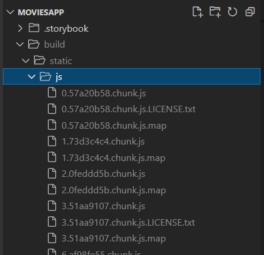

## Independent learning (If relevant).

[State which aspect of the Outstanding grading spectrum you addresses. Include relevant screenshots and links to services used, e.g. Percy project, Deployed app