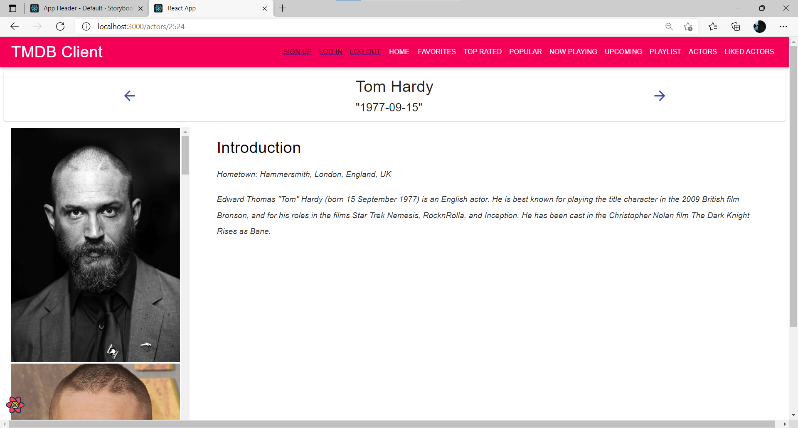

# Assignment 1 - ReactJS app.

Name: Liangyu Chen

## Overview.

A Movie Fan Web App based on React JS and data from TMDB.

### Features.
A bullet-point list of the ADDITIONAL user I added to the Movies Fan app.

+ Feature 1 - Totally 14 endpoints and 9 new endpoints.
+ Feature 2 - Totally 18 views and 11 new views.
+ Feature 3 - Totally 18 Routings with private routing.
+ Feature 4 - Storybook support.
+ Feature 5 - Dynamic and interactive UI, Material UI.
+ Feature 6 - Web Form (reviews, log in, sign up).
+ Feature 7 - Extensive data hyperlinking including 6 parameterized URLs.
+ Feature 8 - Styled Components 3rd party components.
+ Feature 9 - Third-party (Firebase) authentication.
+ Feature 10 - Searching movies by actor and searching credits by movie.
+ Feature 11 - Sorting actors according to popularity.
+ Feature 12 - Full Caching support (useQuery used for every accessing).


## Setup requirements.

Outline any non-standard setup steps necessary to run app locally after cloning the repo.   

```
npm install
```


Install specified version of firebase.
```
npm install firebase@7.14.5
```

Install other supporting libraries mannully.
```
npm install webpack webpack-cli -D
npm install --save-dev http-server
npm install --save-dev  source-map-explorer@2.5.0
```

## API endpoints.
List the TMDB endpoints used, giving the description and pathname for each one.
https://api.themoviedb.org/3/<<>>?api_key=<<api_key>>&language=en-US

+ Discover list of movies. - discover/movie
+ Get a list of movies in theatres. - movie/now_playing
+ Get a list of the current popular movies on TMDB. - movie/popular
+ Get the top rated movies on TMDB. - movie/top_rated
+ Get a list of upcoming movies in theatres. - movie/upcoming

+ Get the primary information about a movie. - movie/{movie_id}
+ Get the list of official genres for movies. - genre/movie/list
+ Get the images that belong to a movie. - movie/{movie_id}/images
+ Get the user reviews for a movie. - movie/{movie_id}/reviews
+ Get a list of recommended movies for a movie. - movie/{movie_id}/recommendations

+ Get the cast and crew for a movie. - movie/{movie_id}/credits
+ Get the list of popular people on TMDB. - person/popular
+ Get the primary person details by id. - person/{person_id}
+ Get the images for a person. - person/{person_id}/images


## App Design.

### Component catalogue.
Insert a screenshot from the Storybook UI that lists all the stories for the app's components, and highlight those relating to __new/modified components__.    


### UI Design.

Insert screenshots of the __new/modified app pages__ developed (and modified existing pages), Include an appropriate caption for each one.

>Top tool bar header to navigate to different pages and log in or out the system. 


>Shows detailed information on a movie. Clicking the 'Reviews' floating action button will display extracts from critic reviews. Clicking "RECOMMENDATIONS" button will display recommendations movies page of this movie. Clicking "CREDITS" will display credits page of this movie.


>Display the recommendations movies page by clicking "RECOMMENDATIONS" button on movie details page.


>A message will pop up by clicking "add to playlist" icon button.


>Display the credits page of this movie by clicking "CREDITS" button on movie detalis page.


>An avator will pop up by clicking "add to likes" icon button.


>Display detailed infromation of this credit by clicking "LEARN MORE" button on the credits page.


>Filter and sort credits using this card.   


>Display actors page by clicking "ACTORS" on the navigation bar.


>Display the starring movies page of this actor by clicking "STARRING MOVIES" button on the actor card.


>Display the likes actors page by clicking "LIKED ACTORS" button on the navigation bar.


>Delete actor from the likes actors page by clicking "DELETE" icon button on actor card.


>Display the top rated movies by clicking "TOP RATED" button on the navigation bar.


>Display the popular movies by clicking "POPULAR" button on the navigation bar.


>Display the must movies by clicking "PLAYLIST" button on the navigation bar.


>Display the login page by clicking "LOG IN" button on the navigation bar.


>A related message will pop up if log in authtication fails.


>Display the signup page by clicking "SIGN up" button on the navigation bar.


>A related message will pop up if sign up authtication fails.


>If the signup authentication passes, an email attached with link will be received. Open the home page of movie fan app by clicking the link. And at firebase website, you can view all the signed up users for this project.


>Full caching support by using useQuery.

### Routing.

List the __new routes__ supported by this app and state the associated page.

+ / - displays discover movies.
+ /movies/:id - displays detailed information page of a movie.
+ /movies/:id/credits - display credits of a movie.
+ /movies/:id/recommendations - display a list of recommended movies of a movie.
+ /movies/topRated - display top rated movies list.
+ /movies/popular - display popular movies list.
+ /movies/nowPlaying - display now playing movies list.
+ /movies/upcoming - display upcoming movies list.
+ /movies/favorites - display movies added in the favorites list.
+ /movies/playlist - display movies added in the playlist.

+ /reviews/form - display form to add a new review.
+ /reviews/:id - to get a list of reviews of a movie.
+ /actors - display the actors list page.
+ /actors/:id - display detailed information of an actor.
+ /actors/:id/movies - display starring movies of an actor.
+ /actors/like - (protected) display the liked actors list aftering logging in.

+ /login - (require authtication) display log in page.
+ /signup - (require authtication) display sign up page.


## Independent learning (If relevant).

+ Firebase user authentication   

Source code filename:   
| src/firebaseAuth/ | src/firebaseAuth/firebaseConfig.js | define config file and import required firebase modules |
| ----------------- | ---------------------------------- | ------------------------------------------------------- |
| src/pages/        | src/pages/loginPage.js             | define login authtication code and login form           |
|                   | src/pages/signupPage.js            | define signup authtication code and signip form         |   
Learning material: https://www.bilibili.com/video/BV16E411n7yC?from=search&seid=14948043773547678991&spm_id_from=333.337.0.0     
Reference: https://hackernoon.com/authentication-in-react-with-firebase-qc3x3vjl   

+ Public and private routing using React Hooks   
Learning material:      
https://blog.csdn.net/weixin_34001430/article/details/93807466     
https://blog.csdn.net/DcTbnk/article/details/107773716     

-------------------------------------------
# Assignment 1 - Agile Software Practice.

+ React SPA construction and configuration  
+ Automated Testing:   
    Unique SPA features.  
    Error/Exception testing.  
    Test case structure (nesting).   
    >Cypress Custom commands.   
    
    
+ Continuous Integration:    
    GitLab CI.    
    
    
    
    
    
    Pipeline - Install, Build, and Test jobs.   
    Branching policy.   
+ Bundling/Code splitting:    
    Webpack (React-scripts)
    
+ Source control:   
    Log history.   
    Branch-Edit-Merge workflow.   
    Pull requests.   
## Automated Testing.

### Best test cases.

+ cypress/integration/login-page.spec.js - line 22
+ cypress/integration/signup-page.spec.js - line 13
+ cypress/integration/likes-page.spec.js - line 99
+ cypress/integration/actors-page.spec.js - line 109
+ cypress/integration/playlist-page.spec.js - line 122

### Cypress Custom commands (if relevant).
+ cypress/integration/signup-page.spec.js
+ cypress/integration/login-page.spec.js

## Code Splitting.


## Independent learning (If relevant).

[State which aspect of the Outstanding grading spectrum you addresses. Include relevant screenshots and links to services used, e.g. Percy project, Deployed app